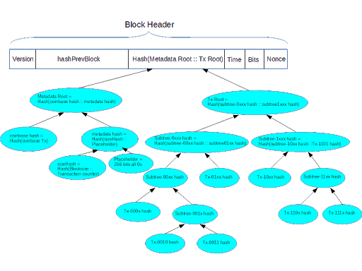

## Motivation and Design Goals

Leave SPV nodes unaffected: Merkle proofs should remain the same
Leave network messages for blocks the same (https://en.bitcoin.it/wiki/Block)
Cover block size and transaction count by POW
Extensible structure to add metadata
Allow efficient insertions and deletions
Make data structure that will enable embarrassingly parallel implementation

## Design Approach

This proposal is to make an initial data structure that is compatible with the current network protocols. This means the it does not contain any additional information, everything can be constructed based on data that nodes currently receive. Additionally, the proposal contains a pre-defined placeholder to allow additional information to be included in the metadata subtree, should that be warranted in the future.

This means that the proposal just re-defines how the Merkle-Root Hash is calculated from the information already defined in the protocol rules.

## Specification

This specification re-defines how the “hashMerkleRoot” field in the block header is calculated.

transactionMerklixRoot is a 256-bit number calculated from the set of transactions, excluding the coinbase transaction. It is calculated as described in the next section

Let “coinbaseHash” be the 256-bit number obtained by computing the double-SHA256 hash of the coinbase transaction.

Let “sizeHash” be the 256-bit number obtained by computing the double-SHA256 hash of the concatenation of the 4-byte Blocksize, and the VarInt 1-9 Bytes Transaction Counter.

Let “Placeholder” be 256 bits of all zeros.

Let “metadataHash” be the 256-bit number obtained by computing the double-SHA256 hash of the concatenation of sizeHash and Placeholder.

Let “metadataRoot” be the 256-bit number obtained by computing the double-SHA256 hash of the concatenation of coinbaseHash and metadataHash.

hashMerkleRoot is calculated as the 256-bit number obtained by computing the double-SHA256 hash of the concatenation of metadataRoot and transactionMerklixRoot.

### Calculating the Transaction Merklix Root

[TODO: describe specification for calculating the Tx Merklix Root]

